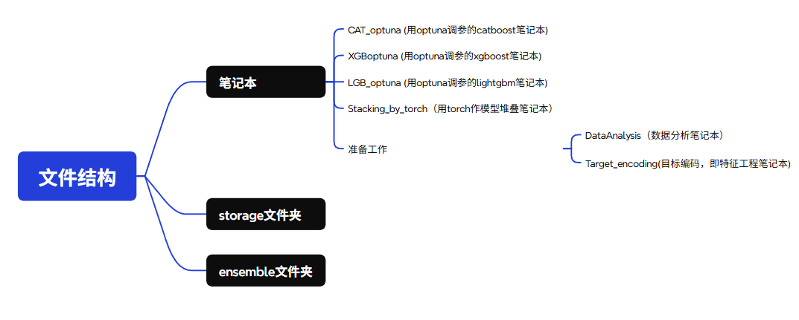

该项目来自，[kaggle11月份 Playground 月赛](https://www.kaggle.com/competitions/playground-series-s5e11)，其中目标编码笔记的灵感和ResNN文件均来自kaggle讨论区，感谢他们的贡献。截止到  2025-11-25 ，成绩在0.92643（368/2945）和 0.92775（29/2945）

如果使用者想要运行CAT_optuna、XGB_optuna、LGB_optuna笔记本，需要先运行 Target_encoding笔记本得到mapping.joblib文件，而运行剩下的笔记本则不必这样做。切记，你需要先运行Extract_file.ipynb文件，因为他会解压缩data。

文件架构如下，ensemble文件夹的文件来自各个笔记本生成的折外预测文件和测试预测文件，用于stacking。storage文件夹存放optuna调参记录、不同cv下的损失曲线图和目标编码生成的mapping.joblib文件（体积比较大，为2.75G），该文件保存cv数据，但由于体积比较大，所以我们最后决定删除它。

同时，我们采用github管理文件，并把项目文件上传到[仓库](https://github.com/osquerkkzlk/2025AI-Work)。

