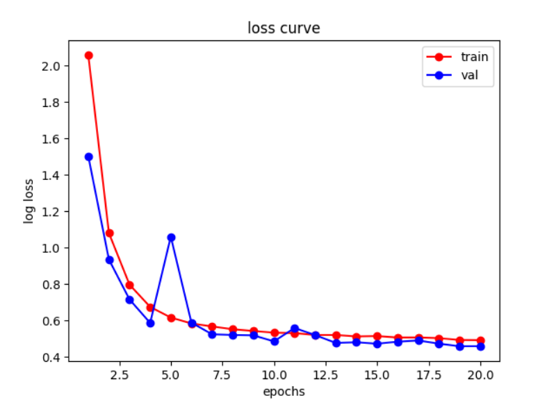
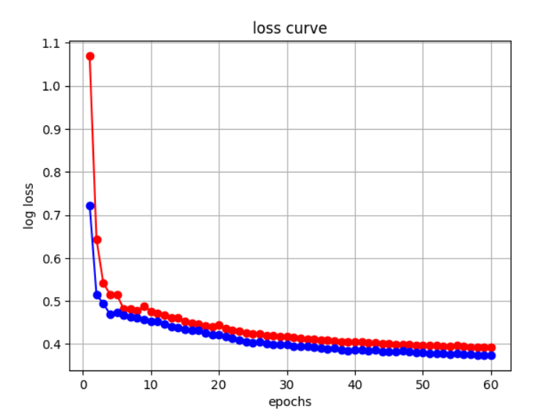

本项目以kaggle时序比赛[store-sales-time-series-forecasting竞赛](https://www.kaggle.com/competitions/store-sales-time-series-forecasting)为背景，采用了LSTM和Transformer两种方法去预测未来16天的序列。我们没有进行复杂的特征工程，只是进行了简单的插值和处理，并取得了 0.47513(LSTM) 和 0.46949（Transformer）。


## 项目框架
```markdown
Store_sales_Project/
├── Storage/
│    ├──LSTM_loss_curve.png
│    ├──Transformer_loss_curve.png
├── README.md
├── based-on-lstm.ipynb
├── based-on-transformer.ipynb
├── based-on-lstm.ipynb
└── data.zip
     
```
## 损失曲线速览

| LSTM                   | Transformer            |
|-------------------------------------|---------------------------------------|
|  |  ||  |


## 成果
1. 解决实际问题，为现实中时序预测提供了参考和借鉴经验。
2. 发布了笔记本，有助于帮助入门的朋友。[见链接](https://www.kaggle.com/code/osquerkkzlk/based-on-lstm)

## 待优化
从损失曲线以及LB分数对比可以看到，模型明显发生了过拟合，在Transformer这种强大的模型上尤为明显。推测数据集的切分上存在一定问题，导致数据泄露，损失偏低而过于乐观。
