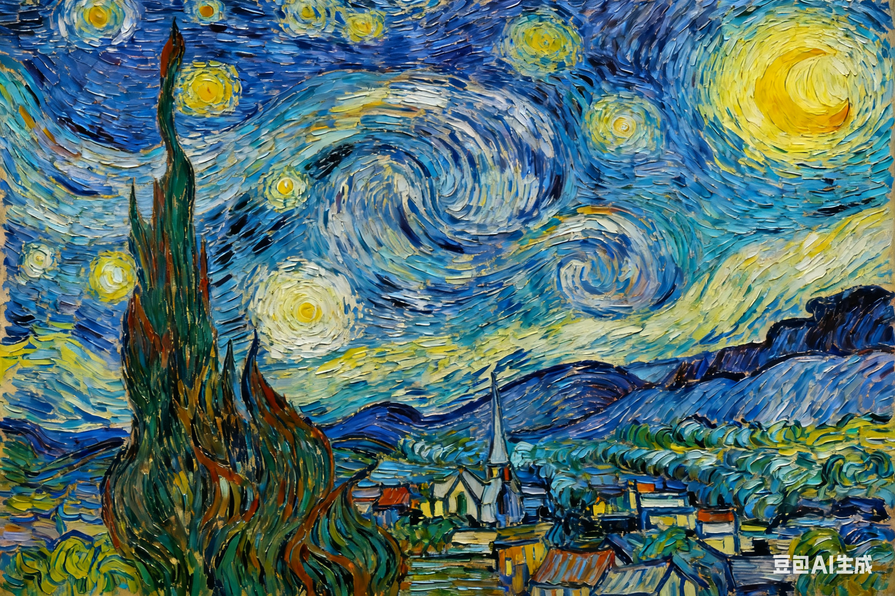
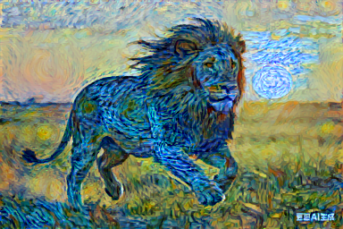

# 项目经历
## V1
本项目实现风格迁移，并提取Image文件夹的图片特征
，最终将生成的图片保存在Storage文件夹，随之一同保存的
还有损失曲线图和过渡图片。同时，我们使用Gradio生成简单的
前端界面，并以本地为后端，实现了网页上传图片即可进行风格迁移。

## V2
我们将模型部署到huggingface上（[链接已失效]()），
推荐您使用VPN，并可以在电脑端、手机端尝试在线风格迁移，由于只能使用免费的cpu，所以生成速度比较慢。

## V3
我们引入进度条模块，同时我们重构了项目代码使逻辑更清晰。这是新的[huggignface链接](https://huggingface.co/spaces/linyuZheng/Style_Transfering)

## 你需要知道的

1.当你运行 main.py文件时，需要上Image文件夹中的图片名称
命名为content * 和style * (其中,*为占位符，后面可以加上你自己的标识和图片后缀，
e.g.content_haha.png 或者 style784.jpg )

2.你可以选择直接运行app.py，并在浏览器打开链接即可在线上传和训练(前提是必须在本地运行，依托本地python环境)。

3.你可以在huggingface上在线训练，不需要本地环境。

## 效果展示😝

|       原始内容图 (Content)        |       原始风格图 (Style)        |         最终结果图 (Result)          |
|:----------------------------:|:--------------------------:|:-------------------------------:|
|  |  |  |

